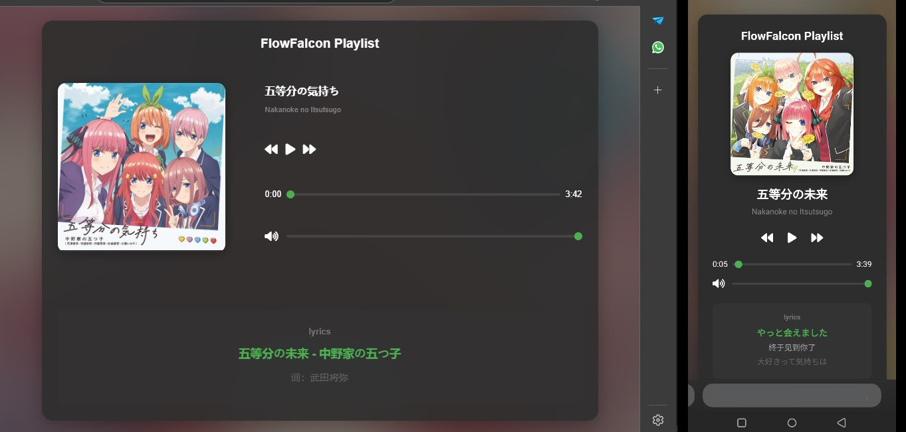

# Music Player Web App

Aplikasi web pemutar musik sederhana dengan fitur lirik yang sinkron.



## Struktur Folder

```
music-player/
├── index.html
├── style.css
├── script.js
├── config.json
├── music/
│   ├── song1.mp3
│   └── song2.mp3
├── lyrics/
│   ├── song1.lrc
│   └── song2.lrc
├── images/
│   ├── album1.jpg
│   └── album2.jpg
└── README.md
```

## Cara Penggunaan

1. **Persiapan File**
   - Buat folder `music/` dan masukkan file musik MP3 Anda
   - Buat folder `lyrics/` dan masukkan file lirik LRC Anda
   - Buat folder `images/` dan masukkan gambar album
> atau bisa juga lewat url agar lebih efesien


2. **Konfigurasi**
   - Edit file `config.json` untuk menambahkan lagu-lagu Anda
   - Sesuaikan path file musik, gambar, dan lirik

3. **Menjalankan Aplikasi**
   - Buka file `index.html` di browser
   - Untuk penggunaan optimal, gunakan server lokal (misalnya dengan VS Code Live Server)

## Format File LRC

File LRC harus mengikuti format standar:
```
[00:12.00]Baris lirik pertama
[00:15.20]Baris lirik kedua
[00:18.50]Baris lirik ketiga
```

## Fitur

- Pemutar musik dengan kontrol play/pause, next, previous
- Progress bar untuk navigasi lagu
- Kontrol volume
- Tampilan lirik yang sinkron dengan musik
- Responsive design untuk desktop dan mobile
- Mudah dikonfigurasi melalui file JSON

## Troubleshooting

1. **Musik tidak diputar**: Pastikan path file di `config.json` sudah benar
2. **Lirik tidak muncul**: Periksa format file LRC dan path-nya
3. **Gambar tidak tampil**: Cek path gambar di `config.json`

## Catatan Penting

- Gunakan server lokal untuk menghindari masalah CORS
- Pastikan semua file memiliki encoding UTF-8
- Untuk hasil terbaik, gunakan gambar album dengan rasio 1:1
